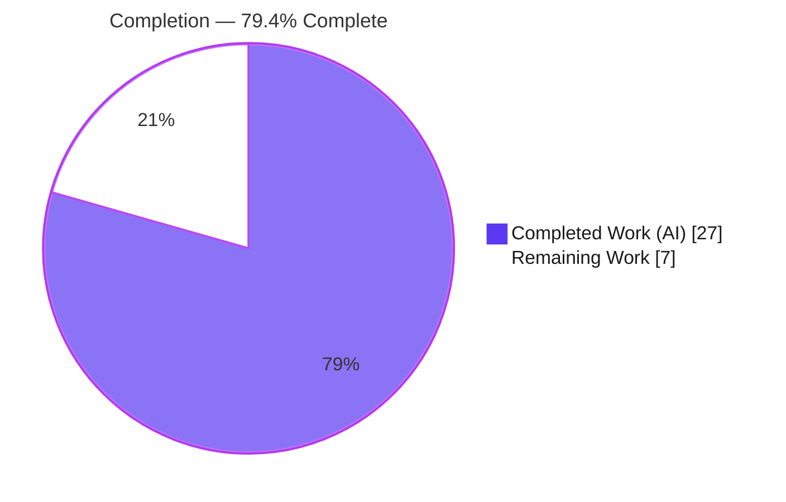
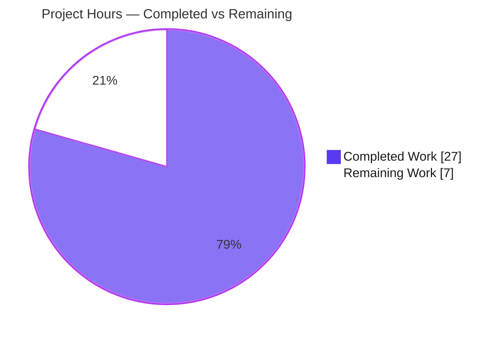
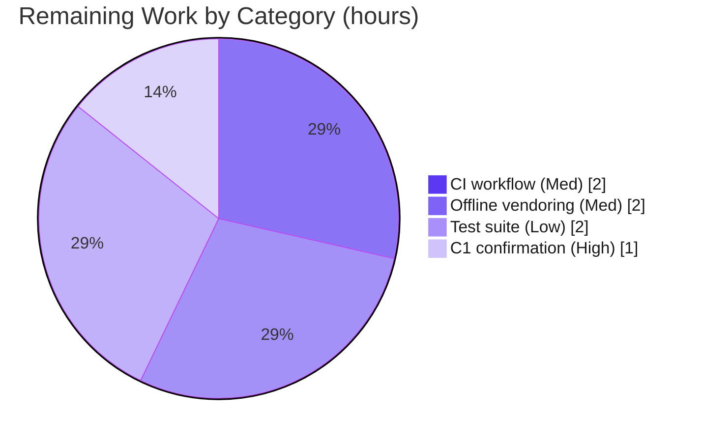

# Blitzy Project Guide — Node.js + Express Tutorial & Executive Presentation

> **Scope anchor:** This guide measures completion against the Agent Action Plan (AAP) only — the build-isolated Node.js + Express tutorial under `nodejs-tutorial/` and the rule-mandated Reveal.js executive presentation under `presentation/` — plus standard path-to-production work. The Berkeley ABC C/C++ toolchain is out of scope and was left entirely untouched.

---

## 1. Executive Summary

### 1.1 Project Overview

This initiative delivers a minimal, self-contained **Node.js + Express tutorial HTTP service** and a rule-mandated **Reveal.js executive presentation**, both added as fully build-isolated artifacts inside the Berkeley **ABC** (Electronic Design Automation) C/C++ repository. The server exposes two plain-text `GET` endpoints — `/` returning `Hello world` and `/good-evening` returning `Good evening` — built on Express.js `5.2.1`. The accompanying six-slide deck briefs C-suite stakeholders on the change, styled from a documented derivation of the ABC/UC-Berkeley visual identity. The technical scope is intentionally small but complete: manifest, server, dependency lockfile, tutorial documentation, repository-hygiene update, and the presentation. The existing C/C++ EDA toolchain (GNU Make, CMake, Bazel) and its CI are entirely unaffected.

### 1.2 Completion Status

The project is **79.4% complete** on an AAP-scoped, hours-based basis. All AAP **feature** requirements (R1–R3, I1–I7, C2, C3, C4) are fully implemented, validated, and committed; the remaining work is a bounded path-to-production tail plus the unresolved repository-scope clarification (C1).



| Metric | Hours |
| --- | --- |
| **Total Hours** | **34.0** |
| Completed Hours (AI + Manual) | 27.0 (AI: 27.0 · Manual: 0.0) |
| Remaining Hours | 7.0 |
| **Percent Complete** | **79.4%** |

> Formula: `27.0 ÷ (27.0 + 7.0) × 100 = 79.4%`. Completed work is 100% AI-delivered; no manual hours have been invested yet.

### 1.3 Key Accomplishments

- ✅ **Express.js 5.2.1 adopted** as the HTTP routing layer (verified current stable, MIT, `node >= 18`), declared in a complete `package.json` with a `start` script.
- ✅ **Both endpoints implemented and byte-exact validated** — `GET /` → `Hello world` (200, 11 bytes), `GET /good-evening` → `Good evening` (200, 12 bytes).
- ✅ **Security hardening beyond the ask** — `X-Powered-By` disabled and a path-free `404 Not Found` handler that never reflects the requested path.
- ✅ **Reproducible dependency tree** — `package-lock.json` pins `express@5.2.1` + 65 packages; `npm ci` reports **0 vulnerabilities**.
- ✅ **Six-slide Reveal.js 6.0.1 executive deck** with a 301-line derived ABC/Berkeley theme, CDN delivery secured by 4 SRI integrity hashes, browser-validated (`Reveal.VERSION = 6.0.1`, `getTotalSlides() = 6`, zero console messages).
- ✅ **Tutorial README** covering prerequisites, install, run, configurable `PORT`, endpoint reference, and quick test.
- ✅ **Complete build isolation** — 0 C/C++ source or build files (`src/**`, Makefile, CMakeLists.txt, BUILD, WORKSPACE, MODULE.bazel) modified; `.gitignore` updated to exclude `node_modules/`.
- ✅ **All five autonomous production-readiness gates PASSED** with no fixes required at final validation.

### 1.4 Critical Unresolved Issues

| Issue | Impact | Owner | ETA |
| --- | --- | --- | --- |
| Repository / prompt mismatch (C1) — the prompt assumes a Node.js server, but the connected repo is the ABC C/C++ EDA toolkit | Scope/decision risk: the deliverable may belong in a different repository | Product / Stakeholder | 1h (decision) |

> No code-level blocking issues exist. The single unresolved item is a **scope clarification**, not a defect: the implementation is complete and validated, but the premise that the Node.js tutorial belongs in this repository requires stakeholder confirmation.

### 1.5 Access Issues

No access issues identified. The npm public registry was reachable (dependencies installed and audited), the jsDelivr CDN serving Reveal.js was reachable during browser validation, and the Git repository (branch `blitzy-9f1d7b91-04dd-4262-ade5-694b90920122`) is fully accessible with a clean working tree.

| System/Resource | Type of Access | Issue Description | Resolution Status | Owner |
| --- | --- | --- | --- | --- |
| npm registry | Dependency download | None — `npm ci` succeeded, 0 vulnerabilities | ✅ No issue | — |
| jsDelivr CDN (reveal.js@6.0.1) | Runtime asset (presentation) | None at validation; offline vendoring is an optional follow-up | ✅ No issue | — |
| Git branch / repository | Source control | None — working tree clean, all deliverables committed | ✅ No issue | — |

### 1.6 Recommended Next Steps

1. **[High]** Confirm the repository/prompt premise with stakeholders (C1) — verify the Node.js tutorial belongs in the ABC repo, or re-point it to the intended repository.
2. **[Medium]** Vendor the Reveal.js 6.0.1 assets locally so the executive deck renders fully offline (no CDN dependency during a live briefing).
3. **[Medium]** Add a scoped Node.js CI workflow (`npm ci` + endpoint smoke test) that does not touch the existing C/C++ CI.
4. **[Low]** Add a committed automated regression test suite (`node:test` + `supertest`) asserting both endpoints and the 404 behavior.

---

## 2. Project Hours Breakdown

### 2.1 Completed Work Detail

| Component | Hours | Description |
| --- | --- | --- |
| Express.js Adoption & Package Manifest (R1, I1) | 2.5 | `package.json` with `express ^5.2.1`, `start` script, `engines.node >= 18`, MIT; dependency research verifying current stable release & Node compatibility |
| Express Server & Dual Endpoints + Security Hardening (R2, R3, I3, I4, C2) | 4.0 | `server.js` Express app: `GET /` → `Hello world`, `GET /good-evening` → `Good evening`; configurable `PORT`; `X-Powered-By` disabled; path-free 404 handler; full inline documentation |
| Dependency Installation & Lockfile (I2) | 1.5 | `npm install` materializing 65 packages; tracked `package-lock.json` pinning `express@5.2.1`; reproducibility verified via `npm ci` (0 vulnerabilities) |
| Tutorial Documentation — README (I6) | 2.0 | `README.md`: prerequisites, install, run, configurable `PORT`, endpoint table, quick test, project layout, repository-discrepancy note |
| Repository Hygiene & Build Isolation (I5, I7, C4) | 1.5 | `.gitignore` update for `node_modules/`; verification that new top-level dirs fall outside Bazel/CMake/GNU-Make source discovery |
| Reveal.js Executive Presentation & Derived Theme (C3) | 8.0 | `presentation/index.html` (6 slides, CDN + 4 SRI hashes, notes plugin) and `assets/theme.css` (301 lines, derived ABC/Berkeley tokens); framework research + design-system derivation |
| Repository Discrepancy Analysis & Surfacing (C1) | 1.5 | Identifying and documenting the prompt-vs-repo mismatch across README, deck, and plan as a visible clarification item |
| Autonomous Validation & QA Fix Cycles | 6.0 | Live endpoint assertions, browser runtime verification, dependency audit, and QA fix cycles (CP2, F-1/F-2/F-3, X-Powered-By, F8/404 hardening) |
| **Total** | **27.0** | **Matches Completed Hours in Section 1.2** |

### 2.2 Remaining Work Detail

| Category | Hours | Priority |
| --- | --- | --- |
| [C1] Stakeholder confirmation of repository/prompt mismatch | 1.0 | High |
| Offline vendoring of Reveal.js 6.0.1 assets (remove CDN runtime dependency) | 2.0 | Medium |
| Node.js CI smoke-test workflow (`npm ci` + endpoint check, scoped to `nodejs-tutorial/`) | 2.0 | Medium |
| Committed automated regression test suite (`node:test` + `supertest`) | 2.0 | Low |
| **Total** | **7.0** | **Matches Remaining Hours in Section 1.2 and Section 7** |

### 2.3 Hours Reconciliation

| Check | Value | Status |
| --- | --- | --- |
| Section 2.1 completed total | 27.0 | ✅ |
| Section 2.2 remaining total | 7.0 | ✅ |
| 2.1 + 2.2 = Total Project Hours | 27.0 + 7.0 = 34.0 | ✅ matches Section 1.2 |
| Remaining identical in 1.2 / 2.2 / 7 | 7.0 | ✅ |

> **Note on scope:** The AAP explicitly marked CI workflows (§0.7.2), a committed test suite (§0.6.2), and offline vendoring (§0.5.4/§0.8.2) as optional/out-of-feature-scope. They are included here as standard **path-to-production** activities per the assessment methodology, which is why completion is reported below 100% even though every AAP *feature* requirement is delivered.

---

## 3. Test Results

All tests below originate from Blitzy's autonomous validation logs for this project and were independently re-verified during this assessment. Per AAP §0.6.2, the project intentionally uses a **minimal live-validation step rather than a committed test suite**; results are reported accordingly.

| Test Category | Framework | Total Tests | Passed | Failed | Coverage % | Notes |
| --- | --- | --- | --- | --- | --- | --- |
| Functional / Endpoint (Phase 4) | Live HTTP assertions (`curl`) | 10 | 10 | 0 | 100% of routes (2/2) | `GET /`, `GET /good-evening`, 404 behavior, headers, `PORT` override |
| Functional / Endpoint (Final re-verification) | Live HTTP assertions (`curl`) | 5 | 5 | 0 | 100% of routes (2/2) | Byte-exact re-check of both endpoints + path-free 404 |
| Security Probes | Live HTTP assertions (`curl`) | 2 | 2 | 0 | — | `X-Powered-By` absent; 404 does not reflect `/SECRETPROBE12345` |
| Runtime / UI (Presentation) | Chrome DevTools (browser) | 6 checks | 6 | 0 | 6/6 slides | `Reveal.VERSION=6.0.1`, `isReady=true`, `getTotalSlides()=6`, notes plugin loaded, theme applied, **0 console messages** |
| Dependency Audit | `npm ci` / `npm audit` | 68 pkgs | 68 | 0 | — | 0 vulnerabilities; lockfile in sync |
| Syntax / Static | `node --check`, JSON/HTML parse | 4 files | 4 | 0 | — | `server.js`, `package.json`, `package-lock.json`, `index.html` |
| **Totals** | — | **17 assertions + 6 runtime checks** | **100% pass** | **0** | — | All gates passed; no fixes required at final validation |

> **Re-verification during this assessment:** `npm ci` → 0 vulnerabilities; `npm start` → `Server listening on http://localhost:3000`; `curl localhost:3000/` → `Hello world` (Content-Length 11, `X-Powered-By` absent); `curl localhost:3000/good-evening` → `Good evening`; unmatched route → `404 Not Found`; `PORT=4000 npm start` served correctly; presentation served via `http.server` (index.html 200, theme.css 200).

---

## 4. Runtime Validation & UI Verification

**Legend:** ✅ Operational · ⚠ Partial · ❌ Failing

**Node.js tutorial service**
- ✅ `npm start` boots cleanly and logs `Server listening on http://localhost:3000`.
- ✅ `GET /` returns `Hello world` (HTTP 200, 11 bytes, no trailing newline).
- ✅ `GET /good-evening` returns `Good evening` (HTTP 200, 12 bytes).
- ✅ Unmatched routes return `404 Not Found` (plain text, no path reflection).
- ✅ `X-Powered-By` response header is absent (framework fingerprint disabled).
- ✅ `PORT` environment override works (validated on 3055, 3077, 4000); default 3000.
- ✅ `npm ci` clean install — 67 packages, audited 68, **0 vulnerabilities**, exit 0.

**Reveal.js executive presentation**
- ✅ Renders in Chrome DevTools served via local `http.server`; `Reveal.VERSION = "6.0.1"`, `Reveal.isReady() = true`.
- ✅ `Reveal.getTotalSlides() = 6` — matches the six-slide executive flow (AAP §0.6.3).
- ✅ Notes plugin loaded from the correct 6.0.1 path (`dist/plugin/notes.js`); press `S` for speaker notes.
- ✅ Derived ABC theme applied — `#1a1a1a` viewport, `#FDB515` California-Gold `h1`, monospace headings; local theme wins the cascade.
- ✅ **Zero console messages** — all 4 CDN SRI integrity hashes valid; inline `data:,` favicon suppresses the default favicon 404.
- ✅ Terminal panel containment verified (no horizontal overflow — QA F-1 fix confirmed).

**API integration outcomes**
- ✅ No cross-tier integration with the ABC C/C++ core exists **by design** — the Node.js service shares no process, FFI, IPC, or build path with the EDA toolkit (AAP §0.4).

---

## 5. Compliance & Quality Review

| AAP Deliverable / Benchmark | Requirement | Status | Evidence / Fix Applied |
| --- | --- | --- | --- |
| R1 — Adopt Express.js | `express@5.2.1`, MIT, `node >= 18` | ✅ Pass | Declared in `package.json`; installed in `node_modules`; pinned in lockfile |
| R2 — `Hello world` endpoint | `GET /` returns exact string | ✅ Pass | `app.get('/')`; validated 200/11 bytes |
| R3 — `Good evening` endpoint | `GET /good-evening` returns exact string | ✅ Pass | `app.get('/good-evening')`; validated 200/12 bytes |
| I1 — Package manifest | `package.json` with `start`, engines | ✅ Pass | Valid JSON, complete |
| I2 — Dependency install | `node_modules` + tracked lockfile | ✅ Pass | 65 pkgs; `npm ci` 0 vulnerabilities |
| I3 — Server entry point | Express app, configurable port | ✅ Pass | `server.js`, `PORT || 3000`, startup log |
| I4 — Route design | Two distinct GET routes | ✅ Pass | Both routes registered |
| I5 — Ignore rule | `node_modules/` git-ignored | ✅ Pass | `.gitignore` updated; `git check-ignore` confirms |
| I6 — Tutorial docs | README with run instructions | ✅ Pass | 76-line `README.md` |
| I7 — Build isolation | New files outside source globs | ✅ Pass | 0 build/src files touched |
| C2 — Exact response strings | Byte-for-byte `Hello world` / `Good evening` | ✅ Pass | Byte-exact validated (11/12 bytes) |
| C3 — Executive presentation | Reveal.js HTML deck, codebase-derived styling | ✅ Pass | 6-slide deck + 301-line derived theme; QA fixes CP2/F-1/F-2/F-3/F8 applied |
| C4 — C/C++ non-regression | No existing source/build modified | ✅ Pass | 0 C/C++/build files changed |
| C1 — Surface repo discrepancy | Mismatch kept visible, not silently resolved | ⚠ Partial | Surfaced in README, deck (slide 6), and plan; **stakeholder confirmation pending** |
| Security — header hardening | No framework fingerprint / path reflection | ✅ Pass | `X-Powered-By` disabled; path-free 404 |
| Security — dependency audit | No known vulnerabilities | ✅ Pass | `npm audit` → 0 vulnerabilities (68 pkgs) |
| Security — supply chain | CDN asset integrity | ✅ Pass | 4 SRI (SHA-384) hashes on all Reveal.js CDN assets |

**Fixes applied during autonomous validation:** QA findings F-1/F-2/F-3 and F8 (deck 6-slide count and accessibility/heading order), CP2 review findings, `X-Powered-By` disablement, and 404 path-reflection hardening were all resolved in prior agent cycles. The final validation pass required **no further fixes**.

**Outstanding compliance item:** C1 — the repository/prompt discrepancy is fully surfaced but awaits a stakeholder decision (tracked in Sections 1.4, 2.2, and 6).

---

## 6. Risk Assessment

| Risk | Category | Severity | Probability | Mitigation | Status |
| --- | --- | --- | --- | --- | --- |
| Repository/prompt mismatch — deliverable may target the wrong repository (C1) | Technical | High | Medium | Stakeholder confirmation; re-point the plan if a different repo was intended | 🔓 Open (surfaced) |
| No committed automated test suite — no regression protection (live validation only) | Technical | Medium | Medium | Add `node:test`/`supertest` suite; wire into CI | 🔓 Open |
| CDN reachability — executive deck fails to render offline | Integration | Medium | Low–Medium | SRI hashes already present; vendor Reveal.js assets for offline use | 🔓 Open |
| No CI/CD gate on future changes to the tutorial | Operational | Medium | Medium | Add a scoped Node.js CI workflow | 🔓 Open |
| CDN supply-chain tampering of Reveal.js assets | Security | Low | Low | 4 SRI (SHA-384) integrity hashes; pinned `@6.0.1` | ✅ Mitigated |
| Dependency vulnerabilities in the Express tree | Security | Low | Low | `npm ci` audited 68 packages → 0 vulnerabilities; lockfile pinned | ✅ Mitigated |
| Information disclosure via headers / 404 path reflection | Security | Low | Low | `X-Powered-By` disabled; path-free 404 handler | ✅ Mitigated |
| Build-system contamination of the ABC C/C++ toolchain | Integration | Low | Low | Isolation verified vs Bazel/CMake/Make globs; 0 files touched | ✅ Mitigated |
| No health-check / monitoring / graceful shutdown | Operational | Low | Low | Acceptable for tutorial scope; add if productionized | 🟡 Accepted (scope) |
| No TLS/HTTPS (plain HTTP on localhost) | Security | Low | Low | Tutorial/localhost scope; add reverse-proxy TLS if ever exposed | 🟡 Accepted (scope) |

**Overall risk posture: LOW.** The only High-severity item is the C1 scope clarification — a decision risk, not a code defect. Every code-level security risk is mitigated, and the remaining open items are bounded path-to-production tasks already captured in Section 2.2.

---

## 7. Visual Project Status

**Project hours breakdown** (Completed = Dark Blue `#5B39F3`, Remaining = White `#FFFFFF`):



**Remaining hours by category** (sums to 7.0h — matches Section 2.2):



| Status | Hours | Share |
| --- | --- | --- |
| 🟦 Completed Work | 27.0 | 79.4% |
| ⬜ Remaining Work | 7.0 | 20.6% |
| **Total** | **34.0** | **100%** |

---

## 8. Summary & Recommendations

**Achievements.** Every AAP *feature* requirement is delivered, validated, and committed. The Node.js + Express tutorial serves both required endpoints with byte-exact responses and meaningful security hardening; dependencies are pinned and audited clean; the six-slide Reveal.js executive deck renders with a documented, provenance-traced ABC theme and zero console errors; and the entire delivery is provably isolated from the Berkeley ABC C/C++ toolchain.

**Remaining gaps.** The project is **79.4% complete** (27.0 of 34.0 hours). The remaining 7.0 hours are path-to-production hardening — offline vendoring of the deck (2h), a scoped CI workflow (2h), and an automated regression suite (2h) — plus the one genuinely open item: **stakeholder confirmation of the repository/prompt mismatch (C1, 1h)**.

**Critical path to production.** (1) Resolve C1 by confirming the target repository; (2) vendor Reveal.js for offline resilience before any live C-suite briefing; (3) add CI and automated tests to protect against regressions.

**Success metrics.** Functional correctness: 100% of routes validated. Security: 0 dependency vulnerabilities, framework fingerprint disabled, CDN assets SRI-pinned. Isolation: 0 C/C++/build files modified. Reproducibility: `npm ci` deterministic from the committed lockfile.

**Production readiness assessment.** The AAP feature is **functionally production-ready and fully validated**. From a strict path-to-production standpoint it is **substantially ready (79.4%)**, gated primarily by the C1 scope decision and three optional-but-recommended hardening tasks. None of the remaining items are code defects; they are decisions and enhancements.

---

## 9. Development Guide

All commands below were executed and verified during this assessment (Node `v20.20.2`, npm `11.1.0`).

### 9.1 System Prerequisites

- **Node.js `>= 18`** (matches `engines.node`; tested on v20.20.2). Verify: `node --version`
- **npm** (bundled with Node; tested 11.1.0). Verify: `npm --version`
- **Python 3** (only to serve the presentation locally). Verify: `python3 --version`
- A modern web browser (for the Reveal.js deck). Internet access is required at deck-render time unless Reveal.js is vendored offline.

### 9.2 Node.js Tutorial — Setup, Install & Run

```bash
# From the repository root
cd nodejs-tutorial

# Reproducible install from the committed lockfile (recommended)
npm ci
# ...or a standard install:
# npm install

# Start the server (default port 3000)
npm start
# Expected stdout: Server listening on http://localhost:3000
```

### 9.3 Verification

```bash
# In a second terminal, exercise both endpoints:
curl -s localhost:3000/              # -> Hello world
curl -s localhost:3000/good-evening  # -> Good evening

# 404 behavior (path-free):
curl -s localhost:3000/anything      # -> Not Found   (HTTP 404)

# Confirm the framework fingerprint header is absent:
curl -sI localhost:3000/ | grep -i x-powered-by   # -> (no output)
```

Expected: `Hello world` and `Good evening` are returned verbatim (no trailing newline); unmatched routes return `Not Found`; no `X-Powered-By` header is present.

### 9.4 Configurable Port

```bash
PORT=4000 npm start
# Expected stdout: Server listening on http://localhost:4000
curl -s localhost:4000/              # -> Hello world
```

### 9.5 Executive Presentation

```bash
# From the repository root
cd presentation
python3 -m http.server 8099 --bind 127.0.0.1
# Then open http://127.0.0.1:8099/index.html in a browser.
# Press "S" to open the speaker-notes view.
```

Expected: a six-slide deck loads with a dark, terminal-inspired theme; the browser console is clean (no errors/warnings).

### 9.6 Troubleshooting

- **`EADDRINUSE` (port already in use):** start on another port — `PORT=4001 npm start`.
- **`node: command not found` or version `< 18`:** install/upgrade Node.js to `>= 18`.
- **Deck appears unstyled or blank:** confirm internet access (Reveal.js loads from the jsDelivr CDN). For offline use, vendor the Reveal.js 6.0.1 assets locally and update the asset paths in `presentation/index.html` (see Section 2.2 / Task HT-2).
- **`npm ci` fails:** ensure you are inside `nodejs-tutorial/` (where `package.json` and `package-lock.json` live) and that the npm registry is reachable.
- **Stopping a backgrounded server:** stop it by its exact process id (`kill <pid>`), not with broad `pkill`.

---

## 10. Appendices

### Appendix A — Command Reference

| Command | Directory | Purpose |
| --- | --- | --- |
| `npm ci` | `nodejs-tutorial/` | Reproducible install from lockfile |
| `npm install` | `nodejs-tutorial/` | Standard install (writes/updates lockfile) |
| `npm start` | `nodejs-tutorial/` | Run the server (`node server.js`) |
| `node --check server.js` | `nodejs-tutorial/` | Syntax check (no execution) |
| `npm audit` | `nodejs-tutorial/` | Dependency vulnerability audit |
| `curl -s localhost:3000/` | any | Test the `Hello world` endpoint |
| `curl -s localhost:3000/good-evening` | any | Test the `Good evening` endpoint |
| `python3 -m http.server 8099 --bind 127.0.0.1` | `presentation/` | Serve the executive deck locally |

### Appendix B — Port Reference

| Port | Service | Notes |
| --- | --- | --- |
| 3000 | Node.js tutorial server | Default; override with `PORT` |
| 8099 | Presentation static server | Example local port for `http.server` |

### Appendix C — Key File Locations

| Path | Mode | Description |
| --- | --- | --- |
| `nodejs-tutorial/package.json` | New | npm manifest (`express ^5.2.1`, `start`, `engines >= 18`, MIT) |
| `nodejs-tutorial/server.js` | New | Express app: both routes, hardening, configurable port (73 lines) |
| `nodejs-tutorial/README.md` | New | Tutorial documentation (76 lines) |
| `nodejs-tutorial/package-lock.json` | New (generated, tracked) | Pins `express@5.2.1` + transitive tree (860 lines) |
| `nodejs-tutorial/node_modules/` | Generated (git-ignored) | 65 installed packages |
| `presentation/index.html` | New | Reveal.js 6.0.1 deck, 6 slides (232 lines) |
| `presentation/assets/theme.css` | New | Derived ABC/Berkeley executive theme (301 lines) |
| `.gitignore` | Updated | Added `node_modules/` rule (only existing-file change) |

### Appendix D — Technology Versions

| Technology | Version | Source / Notes |
| --- | --- | --- |
| Express.js | 5.2.1 | npm dependency (declared `^5.2.1`); MIT |
| Reveal.js | 6.0.1 | jsDelivr CDN, SRI-pinned; MIT |
| Node.js (engine requirement) | `>= 18` | `package.json` `engines` |
| Node.js (validation runtime) | v20.20.2 | Assessment container (AAP planning used v22.22.2) |
| npm | 11.1.0 | Assessment container |

### Appendix E — Environment Variable Reference

| Variable | Default | Consumed by | Purpose |
| --- | --- | --- | --- |
| `PORT` | `3000` | `nodejs-tutorial/server.js` | HTTP listening port |

### Appendix F — Developer Tools Guide

- **Browser DevTools / Chrome:** used to validate the presentation runtime (`Reveal.VERSION`, `getTotalSlides()`, console cleanliness). Open the deck and check the Console tab — it should be empty.
- **`curl`:** primary tool for endpoint validation (see Appendix A).
- **`git check-ignore <path>`:** confirm `node_modules/` is excluded from version control.
- **Stopping background servers safely:** capture the PID at launch (`node server.js & echo $!`) and stop it with `kill <pid>`; avoid broad process killers.

### Appendix G — Glossary

| Term | Definition |
| --- | --- |
| ABC | Berkeley "System for Sequential Logic Synthesis and Formal Verification" — the C/C++ EDA toolkit that hosts this tutorial |
| AAP | Agent Action Plan — the authoritative requirements directive for this work |
| EDA | Electronic Design Automation |
| Express.js | Minimal Node.js web application framework providing HTTP routing |
| Reveal.js | HTML presentation framework used for the executive deck |
| SRI | Subresource Integrity — cryptographic hash that pins exact CDN asset bytes |
| C1–C4 / R1–R3 / I1–I7 | AAP requirement identifiers (constraints, explicit requirements, implicit requirements) |

---

*Completion is measured strictly against AAP-scoped and path-to-production work. The Berkeley ABC C/C++ toolchain is out of scope and was not modified. Brand colors: Completed = `#5B39F3`, Remaining = `#FFFFFF`.*